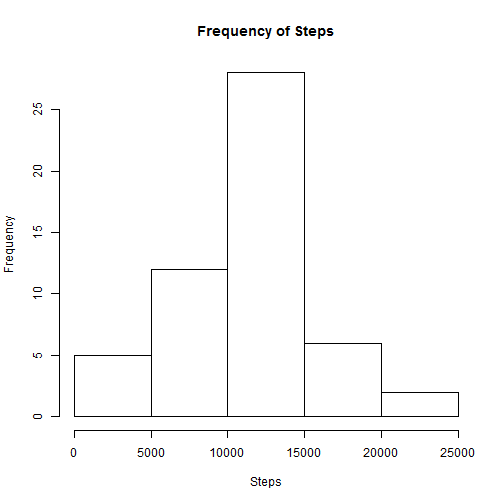
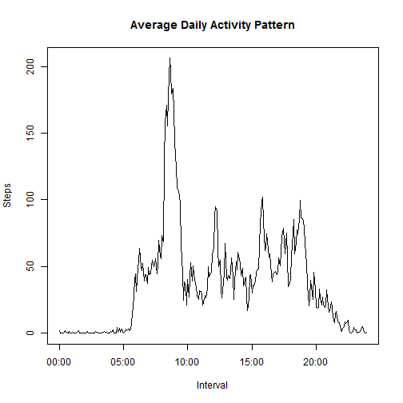
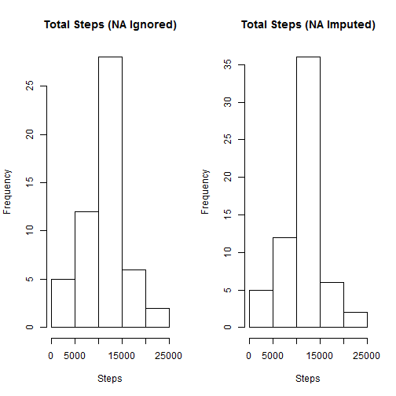

## Loading and preprocessing the data

The data used for this analysis can be downloaded from the following location:

* [Activity monitoring data](https://d396qusza40orc.cloudfront.net/repdata%2Fdata%2Factivity.zip)

This file should be unzipped and the file path within the following code changed to suit your location of the data.
This code block does the following steps:

1. **Load Data**
2. **Aggregate Data:** Total steps taken over all days

note: NAs are ignored in this section


```r
activity <- read.csv("C:/Users/ben33_000/Documents/DataScientistTraining/ReproducibleResearch/Assignment01/RepData_PeerAssessment1/activity.csv",header=TRUE,sep=",",stringsAsFactors=FALSE,strip.white = TRUE)
activity_Agg <- aggregate(steps ~ date, data = activity,sum,na.rm=TRUE)
```


## What is mean total number of steps taken per day?  

In this section I display a Histogram using the aggregated dataset and the Mean and Median values of the Total steps taken for each day.


```r
#Display Histogram showing frequency of Steps
hist(activity_Agg$steps, main="Frequency of Steps",xlab="Steps")
```

 

```r
#Display Mean and Median of total steps over all days
Mean <- mean(activity_Agg$steps)
Median <- median(activity_Agg$steps)
SummaryResults <- data.frame(cbind(Mean,Median))
SummaryResults
```

```
##       Mean Median
## 1 10766.19  10765
```

## What is the average daily activity pattern?  

This section calculates the men for the steps over intervals for all days. A time plot is then displayed with these outputs.
I have used POSIXct to convert the intervals into a time format for accuracy of plotting.

```r
substrRight <- function(x, n){
        substr(x, nchar(x)-n+1, nchar(x))
}


#----- FORMAT DATES -------#
dFormat <- "%Y-%m-%d %H%M"
activity$Date.Time <-as.POSIXct(paste(activity$date,substrRight(paste("0000",activity$interval,sep=""),4)), format=dFormat)
activity$time <- strftime(activity$Date.Time, format="%H:%M:%S")
activity$time <- strptime(activity$time, format="%H:%M:%S")
activity$time <- as.POSIXct(activity$time,format=dFormat)


avg.daily.pattern <- aggregate(steps ~ time, data = activity,mean)
plot(avg.daily.pattern,type = "l",ylab = "Steps", main = "Average Daily Activity Pattern", xlab = "Interval")
```

 

## Imputing missing values  

Note that there are a number of days/intervals where there are missing values (coded as NA). The presence of missing days may introduce bias into some calculations or summaries of the data.

The following code identifies NA values within the dataset

```r
summary(activity)
```

```
##      steps            date              interval     
##  Min.   :  0.00   Length:17568       Min.   :   0.0  
##  1st Qu.:  0.00   Class :character   1st Qu.: 588.8  
##  Median :  0.00   Mode  :character   Median :1177.5  
##  Mean   : 37.38                      Mean   :1177.5  
##  3rd Qu.: 12.00                      3rd Qu.:1766.2  
##  Max.   :806.00                      Max.   :2355.0  
##  NA's   :2304                                        
##    Date.Time                        time                    
##  Min.   :2012-10-01 00:00:00   Min.   :2014-11-11 00:00:00  
##  1st Qu.:2012-10-16 05:58:45   1st Qu.:2014-11-11 05:58:45  
##  Median :2012-10-31 11:57:30   Median :2014-11-11 11:57:30  
##  Mean   :2012-10-31 11:30:52   Mean   :2014-11-11 11:57:30  
##  3rd Qu.:2012-11-15 17:56:15   3rd Qu.:2014-11-11 17:56:15  
##  Max.   :2012-11-30 23:55:00   Max.   :2014-11-11 23:55:00  
## 
```

We can see from this that there are 2304 NAs present in the "Steps" data.

To address this I have taken the following steps:

1. Identify Mean value for every interval over all days
2. Determine all rows where there is an NA present for the steps (Missing)
3. Determine all rows where there is not an NA value (Not Missing)
4. Merge the Mean values with the Missng dataset and replace NA with Mean
5. Bind the Missing dataset with the Not Missing dataset
6. Aggregate the new Imputed data
7. Calculate Mean and Median


```r
#Get Mean Value for each interval over all days  to impute NAs
avg.daily.pattern <- aggregate(activity$steps,list(interval = activity$interval),FUN=mean,na.rm=TRUE)
names(avg.daily.pattern) <- c("interval","mean_steps")
missing <- is.na(activity$steps)                                #Identify NAs
notmissing <- !is.na(activity$steps)                            #Identify non NAs
activity.missing <- activity[missing,]                          #Subset data for NAs

#Merge missing data with mean values
activity.missing <- merge(activity.missing,avg.daily.pattern,by.x = "interval",by.y = "interval")


#Set NAs equal to mean value
activity.missing$steps <- activity.missing$mean_steps


#Bind imputed rows with non NA rows
master <- rbind(activity.missing[,c(2,3,1,4,5)],activity[notmissing,])
master$date <-as.Date(master$date)                              #FormatDate

master <- master[order(master$date),]                           #Order data by date
master_Agg <- aggregate(steps ~ date, data = master,sum)        #Aggregate (Total) data step over date
master_Agg$date <-as.Date(master_Agg$date)                      #FormatDate

#Display Histograms for both Imputed and previous datasets
par(mfrow = c(1,2))
hist(activity_Agg$steps, main="Total Steps (NA Ignored)",xlab="Steps")
hist(master_Agg$steps, main="Total Steps (NA Imputed)",xlab="Steps") 
```

 

```r
#Display Mean and Median comparisons for both Imputed and previous datasets
NA_Handling <- c("Ignored","Imputed")
Mean <- c(round(mean(activity_Agg$steps),2),round(mean(master_Agg$steps),2))
Median <- c(round(median(activity_Agg$steps),2),round(median(master_Agg$steps),2))
Summaryresults <- data.frame(cbind(NA_Handling,Mean,Median))

Summaryresults                                                  #View results
```

```
##   NA_Handling     Mean   Median
## 1     Ignored 10766.19    10765
## 2     Imputed 10766.19 10766.19
```


## Are there differences in activity patterns between weekdays and weekends?


```r
#----------------------------------------------------------------------------------------------------------
## Activity patterns between weekdays and weekends
#----------------------------------------------------------------------------------------------------------

library(lattice)


activity$date <- as.Date(activity$date)
weekend <- weekdays(activity$date) %in% c("Saturday","Sunday")
weekend.f <- factor(weekend, labels = c("Weekday","Weekend"))
activity$Weekday <- weekend.f


Weekday_Agg <- aggregate(steps ~ time + Weekday, data = activity,mean)

xyplot(steps ~ time|Weekday,data=Weekday_Agg,type = "l",layout= c(1,2))
```

 

```r
#----------------------------------------------------------------------------------------------------------
```
